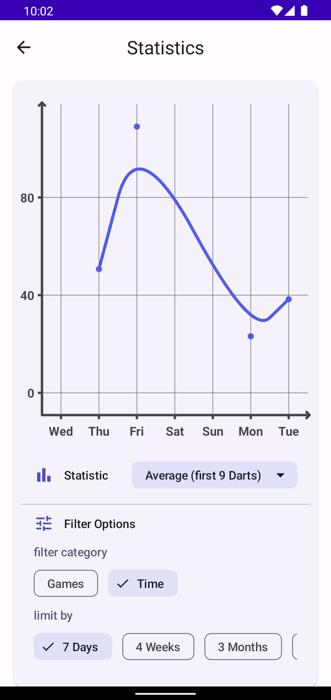

# 🎯 My Dart Stats
### Tracking your daily dart training progress.

## ℹ About the app

My Dart Stats is the perfect app for training the classic 501 mode. It offers a scoreboard with two input options (score or each dart) and a lot of statistics and diagrams to track your progress. 

  
  
  
  
  
  
  
  

You’re able to view your **average**, **average for the first 9 darts**, **average darts per leg**, your **training count** as well as **serve and checkout distribution**. All stats can be filtered by different numbers of games or across several timespans, which allows for tracking your progress over time and analysing your strength and weaknesses. Furthermore, there’s a complete history of all practice games available, which can be sorted by date, dart count or checkout to see your best (or worst) moments at a glance. For each game a detailed page with statistics is available to analyse what happened. 
Lastly there’s an extra table which offers overall stats about using the app and a complete serve distribution history. 

For the time being the app solely focuses on 501 training in single player mode, although different game modes and multiplayer may be added in the future.

The app is available for **Android** in the Google Play Store. [Check it out](https://play.google.com/store/apps/details?id=com.development_felber.dartapp)

## 📩 Feedback

You have a feature request, discovered a bug or any other kind of feedback? 

- Reach out to me via email (development.felber@gmail.com)
- Write a review in the [Google Play Store](https://play.google.com/store/apps/details?id=com.development_felber.dartapp)
- Create an [issue here on GitHub](https://github.com/FelberMartin/DartApp/issues/new)
